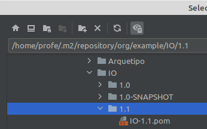

# Programacio1rASIXDAM-IntelliJ
Projectes Java usats pels alumnes de 1r d'ASIX-DAM

\+ informació interessant pels alumnes....


**Info nº 1:**

We can package our Java application into a **JAR** file, but if the project contains some executable code *IntelliJ* unfortunately does not include the main class name in the JAR's manifest and for so, our JAR is not an executable one and we could not run the application with *java -jar* command.

For achieving this we have to add some lines to our ***POM.xml*** project file, more specifically into the **project·build·plugins** section: 

```xml
<!-- This plugin copies third-party dependencies into a local folder, in this case 'libs' -->
<plugin>
	<groupId>org.apache.maven.plugins</groupId>
	<artifactId>maven-dependency-plugin</artifactId>
	<executions>
		<execution>
			<id>copy-dependencies</id>
			<phase>prepare-package</phase>
			<goals>
				<goal>copy-dependencies</goal>
			</goals>
			<configuration>
				<outputDirectory>${project.build.directory}/libs</outputDirectory>
			</configuration>
		</execution>
	</executions>
</plugin>

<!-- This other creates a JAR file when packaging, including the ClassPath for finding the third-party libraries copied to the local folder used in the above plugin, in this case 'libs' -->
<!-- It includes <mainClass> element, containing de FQN of the project's main class -->
<plugin>
	<groupId>org.apache.maven.plugins</groupId>
	<artifactId>maven-jar-plugin</artifactId>
	<configuration>
		<archive>
			<manifest>
				<addClasspath>true</addClasspath>
				<classpathPrefix>libs/</classpathPrefix>
				<mainClass>FQN main class</mainClass>
			</manifest>
		</archive>
	</configuration>
</plugin>
```
The only thing you must change in your ***POM.xml*** is the **FQN main class** with the fully qualified name of your project's main class.

The solution has been obtained from [this web page](https://www.baeldung.com/executable-jar-with-maven).


**Info nº 2:**

Again, we can package our Java application into a **JAR** file, but if the project has third-party library dependencies our application won't run because it won't find the classes in those libraries.

And again, for achieving this we must add some lines to our ***POM.xml*** project file, more specifically into the **project·build·plugins** section: 

```xml
<!-- This plugin creates a JAR file that contains all compiled classes needed for running the application, including third-party library ones -->
<!-- It includes <mainClass> element, containing de FQN of the project's main class, in case of an application JAR -->
<plugin>
<plugin>
    <groupId>org.apache.maven.plugins</groupId>
    <artifactId>maven-assembly-plugin</artifactId>
    <version>3.1.1</version>

    <configuration>
        <archive>
            <manifest>
                <mainClass>FQN main class</mainClass>
            </manifest>
        </archive>
        <descriptorRefs>
            <descriptorRef>jar-with-dependencies</descriptorRef>
        </descriptorRefs>
    </configuration>

    <executions>
        <execution>
            <id>make-assembly</id>
            <phase>package</phase>
            <goals>
                <goal>single</goal>
            </goals>
        </execution>
    </executions>

</plugin>
```
The only thing you must change in your ***POM.xml*** is the **FQN main class** with the fully qualified name of your project's main class.

The solution has been obtained from [this web page](http://tutorials.jenkov.com/maven/maven-build-fat-jar.html).


**Info nº 3:**

When we have built a Java library with Maven, the usual thing is that we want to use it from other projects. For made it easy we must follow these next 2 steps in IntelliJ:
+firstly, we must install our project library into the local Maven repository. We must only execute *mvn install* command in the terminal or in the **IntelliJ's Maven tool window**, having our library project open, of course,
![]                               (imgs/20211029-185433.png)
+secondly, we must open the project where we want to use the library, and add the Maven module generated in the prior step into the **IntelliJ's Maven tool window**, clicking the \+ and selecting the directory in our local Maven repository,



The solution has been inspired from [this web page](https://www.jetbrains.com/help/idea/2020.2/delegate-build-and-run-actions-to-maven.html#link_unlink_maven_project).


